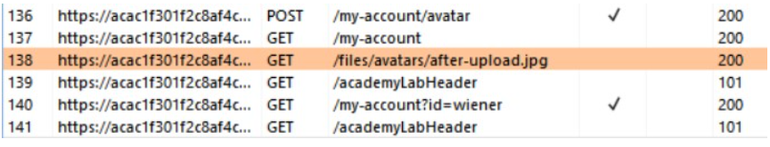
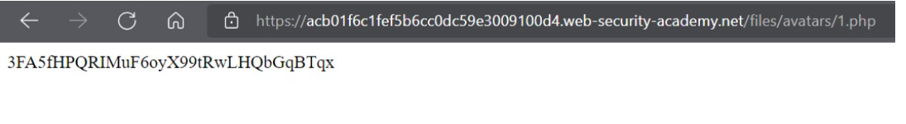

# Lab: Remote code execution via web shell upload
Phòng thí nghiệm này chứa chức năng tải lên hình ảnh dễ bị tổn thương. Nó không thực hiện bất kỳ xác thực nào trên các tệp mà người dùng tải lên trước khi lưu trữ chúng trên hệ thống tệp của máy chủ.

Để giải quyết phòng thí nghiệm, hãy tải lên Shell Web PHP cơ bản và sử dụng nó để tìm hiểu nội dung của tệp `/home/carlos/secret`. 

Bạn có thể đăng nhập vào tài khoản của riêng mình bằng thông tin đăng nhập sau: `Wiener: Peter`

# Bắt đầu.
Bài lab này yêu cầu mình tải lên một đoạn code RCE để có thể kiểm soát web server hay khai thác tải lên tệp không hạn chế để triển khai web shell

Đầu tiên, bật Burp Suite và sử dụng browser của ứng dụng để truy cập vào Lab và thực hiện login bằng tài khoản đã được cung cấp. Vì đây là bài lab liên quan đến upload file nên mình sẽ mò qua phần `My Account` để sử dụng chức năng tải Avatar lên hệ thống.

Sau khi tải thử cái ảnh xàm xí lên hệ thống thì mình nhận được cái thông báo `upload thành công`

Đến đây thì chưa có bất kỳ "clue" nào để mình tiếp tục cả, mò qua HTTP History của chức năng Proxy trong Burp Suite thì ta có thể thấy được các URL mà hệ thống đã thực thi

Như vậy, ta có thể thấy được hệ thống cho phép ta tải lên hình ảnh. Hình ảnh này sẽ được lưu trữ tại `/files/avatars/{tên-tệp}`

Theo như đề bài, secret được cất giữ tại `/home/carlos/secret` và web server sử dụng ngôn ngữ PHP. Do đó, mình sẽ sử dụng một RCE payload code để có thể "reveal" bí mật của chú Carlos và lưu lại với cái tên mỹ miều là `1.php` với playload:
```
<?php echo file_get_contents('/home/carlos/secret'); ?>
```
Sau đó nhấn upload thì vẫn thấy thông báo thành công.  
Và giờ truy cập vào link chứ ảnh avatar thì .. Thanh công lấy được secret

* có thể thấy ở không có kiểm tra file có phải là ảnh hay không mà xử lý tất cả.
