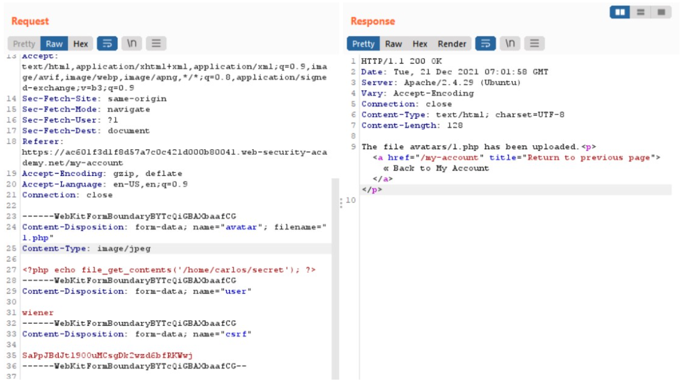
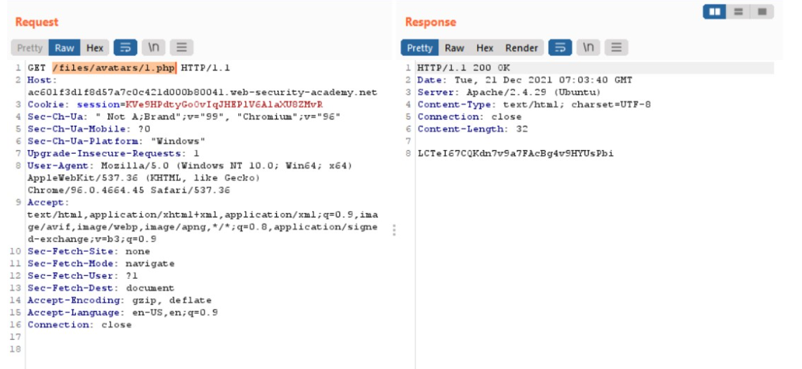

# Lab: Web shell upload via Content-Type restriction bypass
Với website, khi ta gửi một HTML form lên hệ thống, trình duyệt sẽ gửi đi một yêu cầu `POST` trong đó chức các thông tin của yêu cầu đó. Thông thường, các trình duyệt gửi đi các yêu cầu với thuộc tính `Content-Type` là `application/x-www-form-url-encoded`.

Đối với các hệ thống khác nhau, Content-Type được sử dụng các giá trị khác nhau để phù hợp nhất. Bài lab này sẽ yêu cầu ta thực hiện khai thác đánh lừa hệ thống để gửi lên web server một RCE code.
# Bắt đầu
Tương tự như bài lab ở trên, ta thực hiện login vào hệ thống và thử "test" hệ thống bằng cách tải lên tệp 1.php mà mình đã sử dụng ở lab trước thì nhận được thông báo `error`  
Như vậy, hệ thống không cho phép ta tải lên các thể loại tệp thuộc về `application/octet-stream` mà chỉ cho tải lên tệp loại `image/jpeg` hoặc `image/png`  
Đến đây, ta sử dụng Burp Repeater để thử đổi Content-Type sang yêu cầu của Lab và gửi lên web server. Mình sẽ sử dụng request bị dính lỗi khi thử upload 1.php lên hệ thống và đổi lại Content-Type thôi:

Lần này thì ko còn báo lỗi nữa. giờ try cập vào link avatar để xem có gì

-  kiểm tra content-type, nhưng bị bypass bằng cách thay đổi.