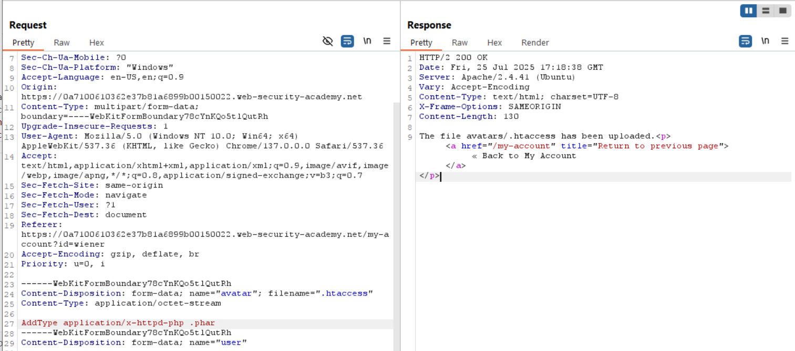
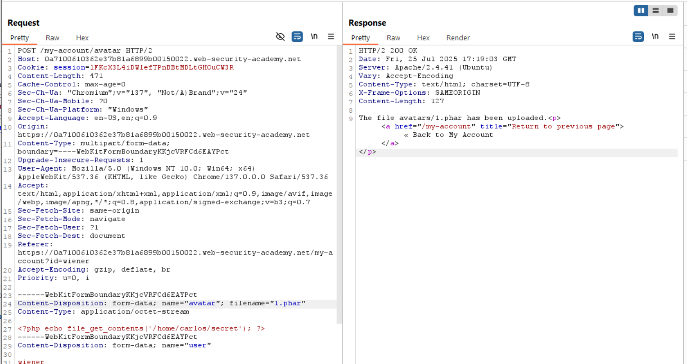

# Lab: Web shell upload via extension blacklist bypass
Trong các phần trên, mình đã có đề cập đến việc sử dụng blacklist để block các loại tệp nguy hiểm. Tuy vậy, các web server vẫn có thể mắc phải các lỗi như cấu hình thiếu chặt chẽ, quản lý file hời hợt khiến attacker có thể dễ dàng "ghi đè" lên tệp cấu hình của server hoặc bypass được blacklist.

Với Apache, server có thể thực thi một tệp PHP theo request và ông dev ổng có thể thêm những cấu hình như cho phép load module nào hoặc thêm các file extension nào lên tệp config (apache2.conf). Bên cạnh đó, nhiều server còn cho phép ông dev upload ghi đè tệp hoặc thêm content vào tệp config. Ví dụ như trong Apache server, nó cho phép load lên một tệp cấu hình cụ thể cho server nếu như trên apache server tồn tại tệp `.htaccess`. Nói vậy thôi, thực tế thì trước khi ta có thể upload một webshell lên hệ thống thì phải trải qua 7749 bước ngăn chặn của server nữa =))))

Trong bài lab này, tác giả yêu cầu ta thực hiện bypass 1 trong 7749 cách ngăn chặn file upload vuln và đó chính là bypass 

# Bắt đầu
Vẫn như trước upload file `1.php` thì có lỗi `Sorry, php files are not allowed Sorry, there was an error uploading your file.` và kiểm tra response thấy `Server: Apache/2.4.41`.  
Đối với server Apache, các dev có thể linh hoạt thêm vào tệp config các loại tệp sẽ được "cho phép" thực thi trên server. Trong `htaccess`, mấy ông dev chỉ cần thêm dòng `AddType application/x-httpd-php {.extension_cần_thêm}`, server sẽ tự override nó vào `/etc/apache2/apache2.conf`. Lợi dụng điều này, ta sẽ sử dụng Burp Repeater để gửi đi 1 POST mới và gắn cái dòng AddType ở bên trên vào filename `.htaccess` ở thư mục hiện tại:

Dùng Burp Suite để tôi tên file:  

Vậy là đã upload thành công giờ chỉ cần f5 là thấy kết quả khi req get ảnh avatar.
