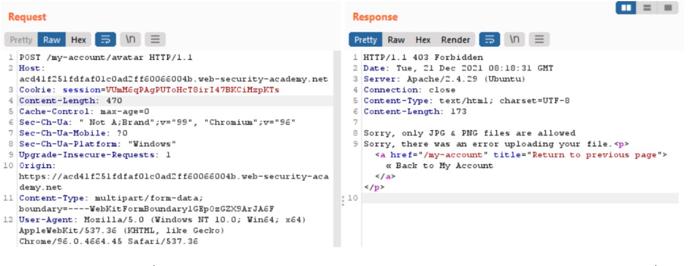
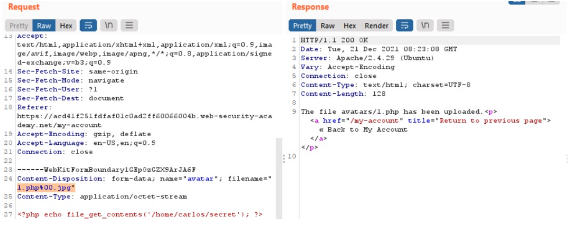

# Lab: Web shell upload via obfuscated file extension null byte
Ở bài lab này, tác giả sẽ yêu cầu ta bypass blacklist các extension của file.

Thử upload 1.php như các lab khác lên server:  
  
Thông báo trả về là ta chỉ có thể upload các extension về hình ảnh (JPG/PNG). Một trong 7749 cách bypass blacklist tiếp theo mình có thể sử dụng đó chính là bypass extension của file với việc sử dụng các trường hợp case sensitive để đánh lừa bộ xác thực của website.  
Nếu như vậy phải phải upload file`1.php.png`. --> upload được nhưng sẽ không exploit được  
-- > Ký tự `NULL` hay `%00` là một trong những ký tự đặc biệt sẽ có thể khiến bộ xác thực hiểu rằng sau nó không còn gì cả và ta thử bằng cách chèn nó vào như sau: `1.php%00.png`  
  
Vậy là đã upload thành công.
