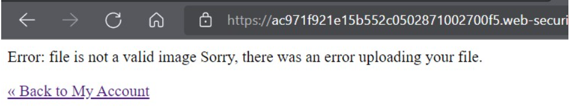
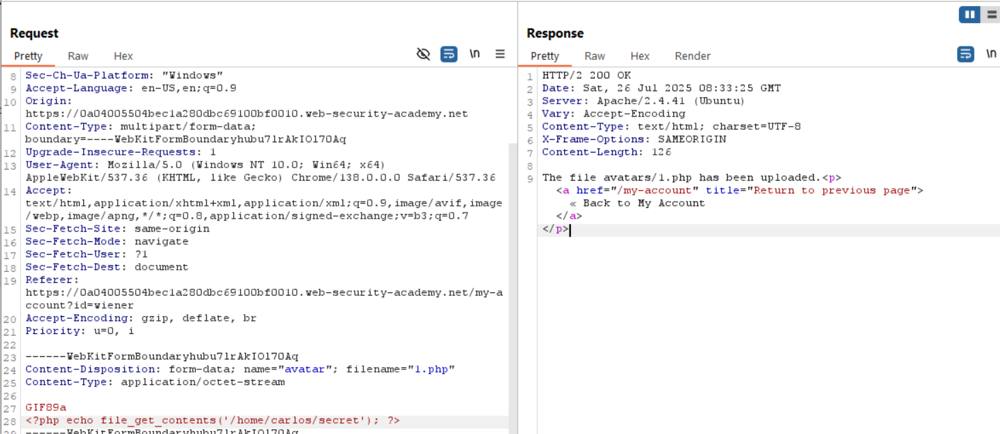

# Lab: Remote code execution via polyglot web shell upload
Để tăng mức độ bảo mật cho hệ thống, các server thay vì xác thức Content-Type thì nó sẽ xác thực nội dung của file. Ví dụ, các file hình ảnh `JPEG` luôn bắt đầu bằng chuỗi bytes `FF D8 FF` và `GIF` luôn bắt đầu bằng `GIF87a` hoặc `GIF89a`.

Bài lab này sẽ thử thách ta bypass mà không thể thay đổi extension của file.

Thử upload 1.php lên server và kết quả trả về:  
  
Lỗi khi upload file không phải là một image.   
Ta có thể tải bất kỳ tệp nào lên server nhưng phải thỏa mãn nó là hình ảnh (PNG/JPG) vì nó là avatar mà. Server sẽ xác thực signature của file như ví dụ mình nêu trên. Do đó, ta sẽ sử dụng trick để "ép" 1 file chừa RCE code thành 1 file thỏa điều kiện của server.

[exiftool](https://github.com/exiftool/exiftool) là một trong những công cụ tối ưu hỗ trợ việc thay đổi metadata của file. Ta sẽ sử dụng nó để thay đổi "dấu hiệu" trong file để làm server nghĩ rằng đó là một file hình ảnh và ta sẽ thêm -Comment="<?php echo 'START ' . file_get_contents('/home/carlos/secret') . ' END'; ?>" vào file exploit.php mà exiftool sẽ tạo ra:
```
exiftool -Comment="<?php echo 'START ' . file_get_contents('/home/carlos/secret') . ' END'; ?>" <YOUR-INPUT-IMAGE>.jpg -o polyglot.php
```
Có thể làm đơn giản hơn là thêm chuỗi `GIF89a` vào đầu file.php để server hiểu nó là 1 file .gif:


Vậy là upload thành công.
